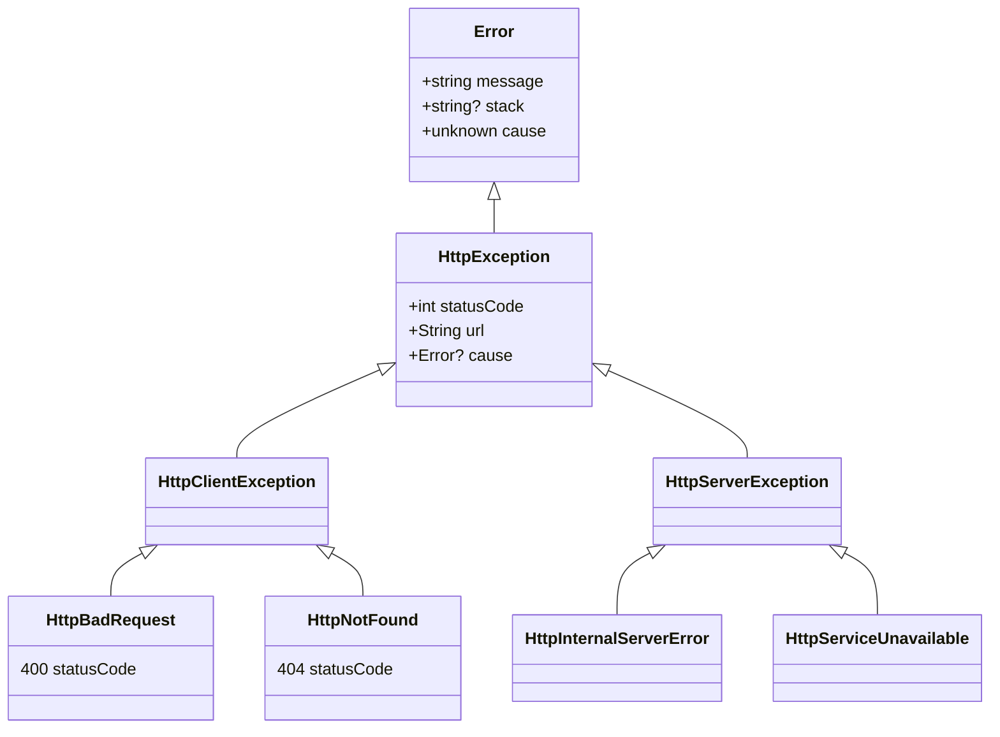

# @belgattitude/http-exception

Delightful http exceptions. Crafted with node, browsers, ssr frameworks, error logging / reporting in mind.
No deps.

[](https://www.npmjs.com/package/@belgattitude/http-exception)
[](https://bundlephobia.com/package/@belgattitude/http-exception@latest)
[](https://browserslist.dev/?q=PjAuMjUlLCBub3QgZGVhZA%3D%3D)
[](https://browserslist.dev/?q=PjAuMjUlLCBub3QgZGVhZA%3D%3D)
[](https://github.com/belgattitude/http-exception/blob/main/packages/http-exception/.size-limit.cjs)
[](https://github.com/belgattitude/http-exception/actions?query=branch%3Amain)
[](https://codecov.io/gh/belgattitude/http-exception)
[](https://codeclimate.com/github/belgattitude/http-exception)
[](https://codeclimate.com/github/belgattitude/http-exception)
[](https://ko-fi.com/belgattitude)

## Install

```bash
npm install @belgattitude/http-exception  # via npm
yarn add @belgattitude/http-exception     # via yarn
```

## Features

- [x] Http exceptions as [named export](#named-exceptions) or via [status code](#factory).
- [x] Allow additional [contextual](#about-context) information (i.e: useful for logging)
- [x] [Json serialization](#serializer) for ssr frameworks, loggers... (i.e. nextjs, superjson, etc)
- [x] [Extends](#uml-class-diagram) native [Error](#about-errorcause) object with [stacktrace](https://developer.mozilla.org/en-US/docs/Web/JavaScript/Reference/Global_Objects/Error/stack) and [Error.cause](#about-errorcause) support.
- [x] Bundled for wide browser support ([0.25%, not dead](https://browserslist.dev/?q=PjAuMjUlLCBub3QgZGVhZA%3D%3D)) with minimal [size](https://github.com/belgattitude/http-exception/blob/main/packages/http-exception/.size-limit.cjs) impact.
- [x] Automatic [error message](#about-default-message) inferred from http exception name.
- [x] Typescript & typedoc with descriptions and links to mdn straight from the ide.

## Documentation

<!-- START doctoc generated TOC please keep comment here to allow auto update -->
<!-- DON'T EDIT THIS SECTION, INSTEAD RE-RUN doctoc TO UPDATE -->

- [Usage](#usage)
  - [Named exceptions](#named-exceptions)
    - [HttpException parameters](#httpexception-parameters)
    - [HttpException properties](#httpexception-properties)
  - [Factory](#factory)
    - [createHttpException](#createhttpexception)
  - [Types and validation](#types-and-validation)
    - [Typeguards](#typeguards)
    - [Instance checks](#instance-checks)
- [Serializer](#serializer)
  - [JSON](#json)
- [Advanced](#advanced)
  - [Non-official status codes](#non-official-status-codes)
- [Notes](#notes)
  - [About default message](#about-default-message)
  - [About context](#about-context)
  - [About Error.cause](#about-errorcause)
- [Examples](#examples)
  - [Backend](#backend)
  - [Frontend](#frontend)
  - [SSR](#ssr)
- [UML class diagram](#uml-class-diagram)
- [List of named exceptions](#list-of-named-exceptions)

<!-- END doctoc generated TOC please keep comment here to allow auto update -->

### Usage

#### Named exceptions

IETF assigned http error status codes are available under individual named exports. They start by the
by `Http` prefix to ease ide experience (suggestions) and to avoid naming collisions
(ie: domain exceptions such as NotFound...). You'll find the current supported list in [this section](#list-of-named-exceptions).

```typescript
import {
  HttpNotFound,
  HttpServiceUnavailable,
} from "@belgattitude/http-exception";
```

##### HttpException parameters

Http exception optionally accepts a parameter of type `string | HttpExceptionParams`. If no parameter
is provided a [default message](#about-default-message) will be set.
When a `string` is provided it will be used as the error message, otherwise you can use the following params:

| HttpExceptionParams | Type      | Description                                                                                                                                                           |
| ------------------- | --------- | --------------------------------------------------------------------------------------------------------------------------------------------------------------------- |
| message             | `string?` | [Error.message](https://developer.mozilla.org/en-US/docs/Web/JavaScript/Reference/Global_Objects/Error/message), see [about default message](#about-default-message). |
| url                 | `string?` | Origin error url, see [about context](#about-context).                                                                                                                |
| cause               | `Error?`  | Error.cause, see also [about error cause](#about-errorcause).                                                                                                         |

Example:

```typescript
import {
  HttpInternalServerError, HttpNotFound,
  HttpNotImplemented,
} from "@belgattitude/http-exception";

// Simple
throw new HttpNotFound(); // message = 'Not found'

// Custom message
throw new HttpNotFound('Record #1234 not found');

// With all properties
throw new HttpInternalServerError({
  message: "Something really wrong happened.",
  url: "https://microservice.example.org/api-gateway",
  cause: new HttpNotImplemented({
    cause: new Error();
  }),
});
```

##### HttpException properties

| HttpException | Type      | Description                                                                                                                        |
| ------------- | --------- | ---------------------------------------------------------------------------------------------------------------------------------- |
| statusCode    | `number`  | Http error status code (400-599).                                                                                                  |
| message       | `string`  | Default or provided message.                                                                                                       |
| url           | `string?` | @see [about exception context](#about-context)(#about-context).                                                                    |
| stack         | `string?` | @see [Error.prototype.stack](https://developer.mozilla.org/en-US/docs/Web/JavaScript/Reference/Global_Objects/Error/Stack) on MDN. |
| cause         | `Error?`  | @see [about error cause](#about-errorcause)                                                                                        |

#### Factory

##### createHttpException

The `createHttpException` function allows to create an exception from an
arbitrary status code.

```typescript
import { createHttpException } from "@belgattitude/http-exception";

const e404 = createHttpException(404); // e404 instanceof HttpClientException
const e500 = createHttpException(500); // e500 instanceof HttpServerException
```

Additional [parameters](#httpexception-parameters) can be provided as a second argument.

```typescript
throw createHttpException(404, "The graal is yet to find !");

throw createHttpException(500, {
  message: "Something really wrong happened.",
  url: "https://microservice.example.org/api-gateway",
  cause: new HttpNotImplemented(), // or any Error...
});
```

> **warning** No checks are done about the validity of the provided status code. See also
> [about non-official status codes](#non-official-status-codes)

#### Types and validation

##### Typeguards

```typescript
import {
  isHttpException,
  isHttpClientException,
  isHttpServerException,
  isHttpErrorStatusCode,
} from "@belgattitude/http-exception";

// True
isHttpErrorStatusCode(404);
isHttpException(new HttpNotFound());
isHttpClientException(new HttpNotFound());
isHttpServerException(new HttpInternalServerError());

// False
isHttpErrorStatusCode(200);
isHttpClientException(new HttpInternalServerError());
isHttpServerException(new HttpNotFound());
isHttpException(new Error());
```

##### Instance checks

> **info** take a look at the [uml class diagram](#uml-class-diagram).

```typescript
// True
new HttpNotFound() instanceof HttpNotFound;
new HttpNotFound() instanceof HttpException;
new HttpNotFound() instanceof HttpClientException;
new HttpInternalServerError() instanceof HttpServerException;

// False
new HttpNotFoundError() instanceof HttpServerException;
new HttpInternalServerError() instanceof HttpClientException;
new Error() instanceof HttpException;
```

### Serializer

HttpException can be serialized to json and vice-versa. It can be useful in ssr frameworks such as
[nextjs](https://nextjs.org/) whenever a server error should be shared within the browser context (see also
[superjson](https://github.com/blitz-js/superjson#recipes)).

Serialization supports the [Error.cause](https://developer.mozilla.org/en-US/docs/Web/JavaScript/Reference/Global_Objects/Error/cause)
but totally ignores it the runtime (node or browser) does not support it (or without polyfills).

Additionally, you can pass any native errors (`Error`, `EvalError`, `RangeError`, `ReferenceError`, `SyntaxError`, `TypeError`, `URIError`)
as well as a custom one (the later will be transformed to the base type Error). That was necessary to support the cause param.

#### JSON

```typescript
import { HttpForbidden } from "@belgattitude/http-exception";
import { fromJson, toJson } from "@belgattitude/http-exception/serializer";

const err = new HttpForbidden({
  url: "https://www.origin.url",
});

const json = toJson(err);
const exception = fromJson(json); // err === exception
```

### Advanced

#### Non-official status codes

While their usage is not recommended, some status codes might be found in the wild (generally server status codes).

```typescript
import {
  createHttpException,
  HttpServerException,
} from "@belgattitude/http-exception";

const nonOfficialStatusCodes = [
  [509, "Might refer to bandwidth limit"],
  [525, "Might refer to SSL Handshake Failed (ie: cloudflare)"],
  [526, "Might refer to Invalid SSL Certificate (ie: cloudflare)"],
  ["...", "..."],
];

const e = createHttpException(509, {
  // optional HttpExceptionParams
}); // `e2 instanceof HttpServerException

// alternatively
const alternate = new HttpServerException({
  statusCode: 509,
  // ...(optional HttpExceptionParams)
});
```

### Notes

#### About default message

The `message` parameter can be omitted for known exceptions. It will be set by default
to the english short text (inferred from exception name).

```typescript
import {
  createHttpException,
  HttpMethodNotAllowed,
} from "@belgattitude/http-exception";

const e1 = new HttpMethodNotAllowed();
const e2 = new HttpMethodNotAllowed("Method not allowed");
const e3 = new HttpMethodNotAllowed({
  message: "Method not allowed",
});
const e4 = createHttpException(HttpMethodNotAllowed.STATUS, {
  message: "Method not allowed",
});
// e1.message === e2.message === e3.message === e4.message
```

#### About context

It's possible to attach a context to the exception (for logging, reporting...). This can be done by passing the following parameters to [HttpExceptionParams](#httpexception-parameters).

| Name | Type      | Description                     |
| ---- | --------- | ------------------------------- |
| url  | `string?` | url on which the error happened |

```typescript
const err = new HttpNotFound({
  url: "https://api.dev/user/belgattitude",
});
console.log(err.url);
```

> **info** As contextual info might cause security concern they should be explicitly added. Please contribute or open an issue.

#### About Error.cause

Http exceptions and the [serializer](#serializer) support the recent [Error.prototype.cause](https://developer.mozilla.org/en-US/docs/Web/JavaScript/Reference/Global_Objects/Error/cause#browser_compatibility). When not
available in the runtime (browser, node, deno, edge...) the library simply discard the parameter (no runtime error).

```typescript
const err = new HttpNotFound({ cause: new Error() });
console.log(err.cause); // undefined if not supported by runtime
```

> **info** Error.prototype.cause is supported on node >= 16.9.0 and. Caniuse.com indicates a support for
> [89% of browsers](https://caniuse.com/mdn-javascript_builtins_error_error_options_cause_parameter).
> as of September 2022. There's few polyfills that can be used if needed ([error-cause-polyfill](https://github.com/ehmicky/error-cause-polyfill),
> [error-cause](https://github.com/es-shims/error-cause)...)

### Examples

Examples are given "as is" and does not represent a real-world usage.

#### Backend

```typescript
import type { IncomingMessage, ServerResponse } from "node:http";
import { toJson } from "@belgattitude/http-exception/serializer";
import {
  HttpForbidden,
  HttpImATeapot,
  HttpInternalServerError,
  HttpNotFound,
  HttpUpgradeRequired,
  isHttpServerException,
} from "@belgattitude/http-exception";

// Imaginary logger
const ignoredCodes = [HttpNotFound.STATUS, HttpImATeapot.STATUS];
const logHttpException = (e: HttpException, req: IncomingMessage): void => {
  if (ignoredCodes.includes(e.statusCode)) return;
  const level = isHttpServerException(e) ? "critical" : "error";
  // Could be sentry, pino logger, winston...
  console.log(level, req.headers["host"], toJson(e));
};

// A global error handler / middleware / higher order function...
const withErrorHandler =
  (handler: (req: IncomingMessage, res: ServerResponse) => void) =>
  (req: IncomingMessage, res: ServerResponse) => {
    try {
      handler(req, res);
    } catch (e) {
      if (isHttpException(e)) {
        // Call the logger
        logHttpException(e, req);
        res.status(e.statusCode).json({
          success: false,
          error: {
            // Choose what is useful to expose
            message: e.message,
          },
        });
      }
    }
  };

// An imaginary situation
const fetchData = async () => {
  throw new HttpInternalServerError({
    message: "Something really wrong happened today.",
    url: "https://microservice.example.org/api-gateway",
    cause: new HttpUpgradeRequired("Received from the api gateway"),
  });
};

// The route handler: could be nextjs, express, fastly...
const apiRouteHandler = async (req: IncomingMessage, res: ServerResponse) => {
  if (!req.headers["authorization"]) {
    throw new HttpForbidden("Missing authorization header");
  }
  const data = await fetchData();
  res.json({ success: true, data });
};

export default withErrorHandler(apiRouteHandler);
```

#### Frontend

Wip - @todo axios / react-query

#### SSR

Wip - @todo nextjs getServerSideProps

### UML class diagram



### List of named exceptions

Client http status error codes (400...499). Link to

| Status | Class                           |
| ------ | ------------------------------- |
| 400    | HttpBadRequest                  |
| 401    | HttpUnauthorized                |
| 402    | HttpPaymentRequired             |
| 403    | HttpForbidden                   |
| 404    | HttpNotFound                    |
| 405    | HttpMethodNotAllowed            |
| 406    | HttpNotAcceptable               |
| 407    | HttpProxyAuthenticationRequired |
| 408    | HttpRequestTimeout              |
| 409    | HttpConflict                    |
| 410    | HttpGone                        |
| 411    | HttpLengthRequired              |
| 412    | HttpPreConditionFailed          |
| 413    | HttpPayloadTooLarge             |
| 414    | HttpUriTooLong                  |
| 415    | HttpUnsupportedMediaType        |
| 416    | HttpRangeNotSatisfiable         |
| 417    | HttpExpectationFailed           |
| 418    | HttpImATeapot                   |
| 421    | HttpMisdirectedRequest          |
| 422    | HttpUnprocessableEntity         |
| 423    | HttpLocked                      |
| 424    | HttpFailedDependency            |
| 425    | HttpTooEarly                    |
| 426    | HttpUpgradeRequired             |
| 428    | HttpPreconditionFailed          |
| 429    | HttpTooManyRequests             |
| 431    | HttpRequestHeaderFieldsTooLarge |
| 451    | HttpUnavailableForLegalReasons  |

Server http status error code

| Status | Class                             |
| ------ | --------------------------------- |
| 500    | HttpInternalServerError           |
| 501    | HttpNotImplemented                |
| 502    | HttpBadGateway                    |
| 503    | HttpServiceUnavailable            |
| 504    | HttpGatewayTimeout                |
| 505    | HttpVersionNotSupported           |
| 506    | HttpVariantAlsoNegotiates         |
| 507    | HttpInsufficientStorage           |
| 508    | HttpLoopDetected                  |
| 510    | HttpNotExtended                   |
| 511    | HttpNetwordAuthenticationRequired |
